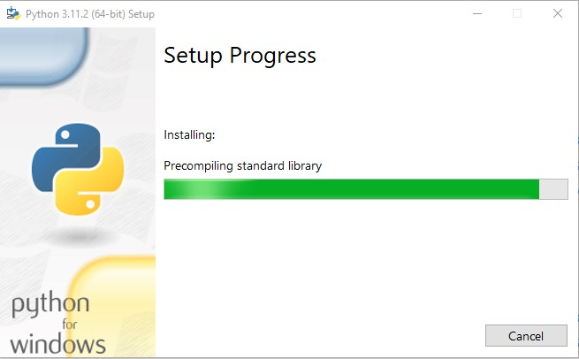
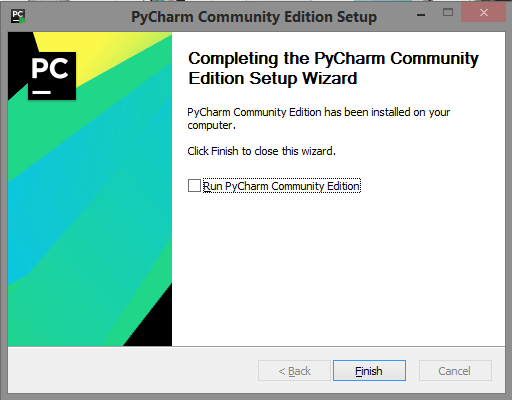

[Вернуться на главную](https://github.com/BEPb/Python-100-days)

## Знакомство с Python

#### Введение в Python-История Python

#### Как появился Python
В конце восьмидесятых голландский программист Гвидо ван Россум работал в научно-исследовательском центре математики 
и информатики, в котором создавал язык программирования ABC. Гвидо вкладывал все силы в этот проект и многому 
научился в работе над ним.  

В декабре 1989 года офис закрылся на рождественские каникулы, и Гвидо было нечем заняться. Тогда он просто ради 
развлечения написал интерпретатор для нового языка программирования. Свой несерьезный проект он назвал «Пайтон» в 
честь любимого комедийного шоу «Летающий Цирк Монти Пайтона».  

#### Как развивался Python
Уже в 1991 году вышел первый релиз Python версии 0.9.0. Новый язык вобрал в себя многие идеи из ABC, а также из 
других языков: например, система модулей взята из языка Modula-3. 

Еще немного позже вышла версия 1.0. В ней появились элементы функционального программирования — функции map, filter, 
reduce. 

В версии 2.0 появились знаменитые списковые включения, позаимствованные из языков SETL и Haskell. Тогда же появился 
сборщик мусора — механизм автоматического управления памятью. В той же второй версии в нем появилась поддержка 
работы с циклическими структурами.  

Python постоянно развивается с самого начала и до сегодняшнего дня. Сейчас почти все используют следующую, третью 
версию. 

#### В чем особенности Python как инструмента
Python изначально позиционировался как «язык для каждого», поэтому в нем сделан упор на читаемость кода и лаконичность синтаксиса. Эта философия делает язык более понятным и востребованным для новичков.

Тем не менее в работе с Python есть моменты, о которых нужно поговорить подробнее.

#### Избегайте legacy-библиотек
Первый релиз третьей версии Python вышел еще в 2008 году, но переход на него идет до сих пор.

Дело в том, что третья версия не полностью обратно совместима со второй. Чтобы перейти на третью версию, нельзя 
просто заменить интерпретатор — придется менять код. Разработчики идут на такой шаг, если проект все еще развивается. 

Но есть программы, работа над которыми закончена: они находятся в состоянии «только поддержка» и называются legacy. 
Такие проекты часто не переходят на третью версию — обычно просто некому заниматься адаптацией. 

Если программа становится legacy-проектом, никаких новых трудностей не возникнет. Сложнее ситуация с библиотеками. 
Некоторые важные библиотеки все еще написаны на второй версии. Обновлять их некому, а заменить — пока нечем. 

Именно поэтому переход на третью версию Python растянулся так надолго.

Более того, с 2020 года вторая версия больше не поддерживается — в ней перестали устранять уязвимости и критические 
ошибки. Теперь устаревшие библиотеки могут нести в себе угрозу для всего проекта. 

К счастью, большинство популярных и востребованных библиотек уже переведены на третью версию, а все современные 
рекомендовано писать на Python 3.7.x. 


1. Рождение - 1989 год: Гвидо фон Россум начал писать компилятор для языка Python.
2. Февраль 1991: Родился первый компилятор Python (также интерпретатор), который был реализован на языке C (Си) и 
   может вызывать библиотечные функции. 
В самой ранней версии Python обеспечивал поддержку «класса», «функции», «обработки исключений» и других строительных 
блоков, а также основных типов данных, таких как списки и словари, и поддерживает построение приложений на основе модулей.
3. Январь 1994: Официальный выпуск Python 1.0.
4. 16 октября 2000 г.: был выпущен Python 2.0, в котором была добавлена полная сборка и обеспечена поддержка 
   Unicode. При этом весь процесс разработки Python более прозрачен, влияние сообщества на ход разработки постепенно расширяется, и экосистема начинает медленно формироваться.
5. 3 декабря 2008 г.: был выпущен Python 3.0. Он не полностью совместим с предыдущим кодом Python. Однако, поскольку 
   многие компании в настоящее время используют Python 2.x в своих проектах и операциях, появилось много новых Python 3.x. Эта функция была позже перенесен на версию Python 2.6 / 2.7.


Гвидо фон Россум

Даты выпуска основных и промежуточных версий:

- Python 1.0 — январь 1994 года
    - Python 1.5 — 31 декабря 1997 года
    - Python 1.6 — 5 сентября 2000 года
- Python 2.0 — 16 октября 2000 года
    - Python 2.1 — 17 апреля 2001 года
    - Python 2.2 — 21 декабря 2001 года
    - Python 2.3 — 29 июля 2003 года
    - Python 2.4 — 30 ноября 2004 года
    - Python 2.5 — 19 сентября 2006 года
    - Python 2.6 — 1 октября 2008 года
    - Python 2.7 — 3 июля 2010 года
- Python 3.0 — 3 декабря 2008 года
    - Python 3.1 — 27 июня 2009 года
    - Python 3.2 — 20 февраля 2011 года
    - Python 3.3 — 29 сентября 2012 года
    - Python 3.4 — 16 марта 2014 года
    - Python 3.5 — 13 сентября 2015 года
    - Python 3.6 — 23 декабря 2016 года
    - Python 3.7 — 27 июня 2018 года
    - Python 3.8 — 14 октября 2019 года
    - Python 3.9 — 5 октября 2020 года
    - Python 3.10 — 4 октября 2021 года

### Преимущества и недостатки Python
#### Python имеет множество преимуществ, которые можно кратко резюмировать следующим образом.

1. Простой и понятный, кривая обучения невысока, и его легче выучить, чем многие языки программирования.
2. Открытый исходный код, сильное сообщество и экосистема, особенно в области анализа данных и машинного обучения.
3. Интерпретируемые языки по своей сути переносимы на платформу, и код может работать в разных операционных системах.
4. Обеспечивает поддержку двух основных парадигм программирования (объектно-ориентированное программирование и 
   функциональное программирование).
5. Код очень стандартизирован и удобочитаем, подходит для людей с чистотой кода и обсессивно-компульсивным 
   расстройством.


#### Недостатки Python в основном сосредоточены в следующих моментах.

1. Эффективность выполнения немного ниже, а части, требующие высокой эффективности выполнения, могут быть написаны на 
других языках (например, C, C ++).
2. Код нельзя зашифровать, но теперь многие компании продают не программное обеспечение, а услуги, и эта проблема 
   будет решена.
3. Слишком много фреймворков для выбора во время разработки (например, существует более 100 веб-фреймворков), и есть 
   ошибки там, где есть выбор.
4. Python не самый быстрый среди языков программирования. Скорость выполнения программ может быть ниже.
5. Не самый удобный язык для мобильных разработок
6. Из-за гибкости типов данных потребление памяти Python не минимальное

Весомые это минусы или нет, решать вам, исходя из ваших целей. На наш взгляд, на фоне положительных качеств Python, 
эти минусы теряют значимость. 

#### Области применения Python
В настоящее время Python широко используется в областях серверной разработки веб-приложений, построения облачной 
инфраструктуры, DevOps, сбора сетевых данных (краулер), автоматического тестирования, анализа данных и машинного 
обучения.

#### Установка Python на Windows
Для начала проверь, какая версия Windows у тебя на компьютере — 32-битная или 64-битная. 
Скачивать python будем с [официального сайта](https://www.python.org/). Кстати, не рекомендую скачивать 
интерпретатор python с других сайтов или через торрент, в них могут быть вирусы. Программа бесплатная. Заходим на 
https://python.org/downloads/windows/, выбираем "latest python release" и python 3. 

После загрузки дистрибутива ты должна запустить его (двойным щелчком) и следовать инструкциям.

Обрати внимание на экран мастера установки, который называется «Setup» (Настройка): тебе нужно пролистать его вниз и 
выбрать опцию «Add Python 3.11 to the PATH» (Добавить Python 3.11 к системной переменной PATH), как на рисунке (это 
может выглядеть по-разному в зависимости от версии, которую ты устанавливаешь), это даст возможность запускать ваш 
код прямо из командной строки:  





Убедись, что установка прошла успешно, открыв приложение Терминал:
1. (одновременно нажмите кнопки win+R) и набираем команду 'cmd', 
2. после чего нажмите на кнопку 'ок'


```commandline
python --version
```

3. в открывшемся окне терминала вводим следующую команду и нажимаем клавишу Enter (он же Ввод):


4. ниже должна появится строка с версией установленного питона, которая свидетельствует о том что у нас все получилось


#### Установка Python на linux системы (ubuntu, linux mint и другие)
Откройте консоль (обычно ctrl+alt+t). Введите в консоли:
```
python3
```
Скорее всего, вас любезно поприветствует python 3, если это не так введите команду:
```
sudo apt-get install python3
```

#### Установка Pycharm на Windows
JetBrains PyCharm — это интегрированная среда разработки (IDE), используемая для написания программ на Python. В ней есть инструменты для анализа кода, графический отладчик, встроенное модульное тестирование и поддержка веб-разработки с Django.

Для установки PyCharm сперва нужно установить интерпретатор Python (это мы уже выполнили). Дальше — пошаговый процесс 
установки PyCharm.

1. Перейдите на сайт JetBrains https://www.jetbrains.com/pycharm/. PyCharm — это проект JetBrains.


2. Нажмите «Download». Произойдет перенаправление на страницу загрузки PyCharm.
3. Дальше необходимо выбрать версию PyCharm: Community или Professional. Professional — это платная версия с полным 
   набором функций. Она идеально подходит для профессиональной разработки. Community бесплатная, для нас как 
   начинающих программистов ее будет более чем предостаточно. Ею можно 
   пользоваться благодаря набору базовых возможностей. После нажатия на кнопку «Загрузить» скачивание начнется 
   автоматически.


4. Теперь необходимо запустить установку. Нажмите «Next».


5. Поставьте галочки напротив обоих пунктов, если нужен ярлык для рабочего стола. 

6. После завершения установки поставьте галочку напротив «Run PyCharm Community Edition» для запуска, а затем «Finish».

7. Если вы только учите язык Python и установили PyCharm впервые, тогда выберите пункт «I do not have a previous version of PyCharm or I do not want to import my settings» и «ОК».
8. PyCharm запустится. Первый раз этой займет больше времени.
9. После приветственного окна нажмите «Open».
10. Выберите директорию в которой находится наш курс. Во втором поле нужно указать местоположение интерпретатора Python 
   (который уже должен быть установлен). Обычно PyCharm находит его самостоятельно. Если не удалось, нужно указать 
   путь к нему.


#### Запуск первой программы
Для запуска первой программы, открываем ее код по адресу /День 01-15/День 01/01.привет_мир.py дважды кликнув по 
файлу левой клавишей мыши. Для ее запуска необходимо по файлу нажать правой клавишей мыши, в появившемся меню 
выбрать 'run 01.привет_мир.py'


Тоже самое Вы можете проделать и из командной строки.
Для запуска программы на питоне из командной строки, необходимо перейти в папку с программой (это директория 
первого дня обучения) и ввести команду:
```
python 01.привет_мир.py  # программа для отображения фразы 'hello, world!'
```


Следующая программа находится в этой же директории:

02.flag.py - Следующая программа - рисовалка флага китая, с подробным описанием ее выполнения.

Для запуска этой программы на питоне из командной строки, необходимо перейти в папку с программой и ввести команду:
```
python 02.рисуем_флаг.py
```

03.peppa_pig.py - Еще одна программа - рисовалка свинки пейпы 

Для запуска этой программы на питоне из командной строки, необходимо перейти в папку с программой и ввести команду:
```
python 03.рисуем_свинку.py
```

[Вернуться на главную](https://github.com/BEPb/Python-100-days)

[К следующему занятию](https://github.com/BEPb/Python-100-days/blob/master/%D0%94%D0%B5%D0%BD%D1%8C%2001-15/%D0%94%D0%B5%D0%BD%D1%8C%2002/00.%D0%AD%D0%BB%D0%B5%D0%BC%D0%B5%D0%BD%D1%82%D1%8B_%D1%8F%D0%B7%D1%8B%D0%BA%D0%B0.md)