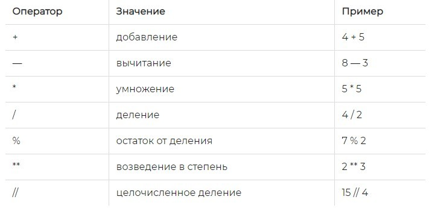
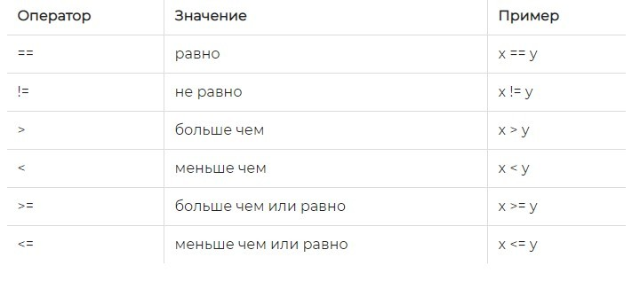
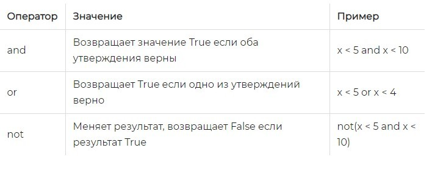
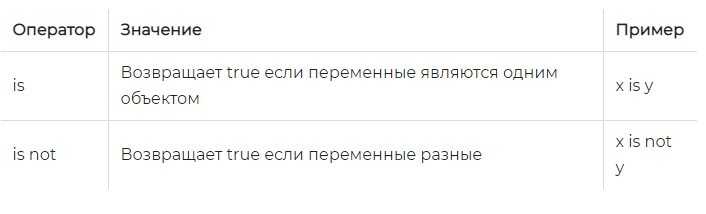
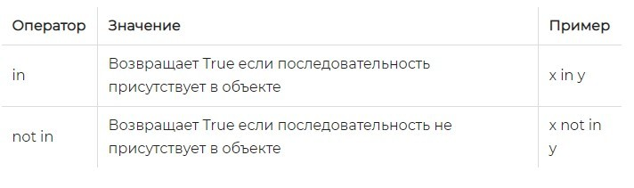
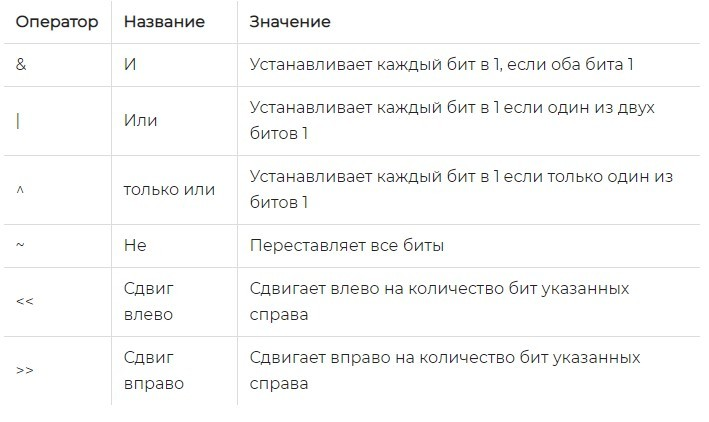

[Вернуться на главную](https://github.com/BEPb/Python-100-days)

## Элемент языка

#### Переменные и типы данных

Переменная хранит определенные  данные. Название переменной в Python должно начинаться с алфавитного символа или со 
знака подчеркивания и может содержать  алфавитно-цифровые символы и знак подчеркивания. И кроме того, название 
переменной не должно совпадать с названием ключевых слов языка Python. Ключевых слов не так много, их легко 
запомнить: and, as, assert, break, class, continue, def, del, elif, else, except, False, finally, for, from, global,
if, import, in, is, lambda, None, nonlocal, not, or, pass, raise, return, True, try, while, with, yield.


### Переменные

Переменная хранит данные одного из типов данных. В Python существует множество различных типов данных, которые 
подразделяются на категории: числа, последовательности, словари, наборы:

boolean - логическое значение True или False

int - представляет целое число, например, 1, 4, 8, 50.

float - представляет число с плавающей точкой, например, 1.2 или 34.76

complex - комплексные числа

str - строки, например "hello". В Python 3.x строки представляют набор символов в кодировке Unicode

bytes - последовательность чисел в диапазоне 0-255

byte array - массив байтов, аналогичен bytes с тем отличием, что может изменяться

list - список

tuple - кортеж

set - неупорядоченная коллекция уникальных объектов

frozen set - то же самое, что и set, только не может изменяться (immutable)

dict - словарь, где каждый элемент имеет ключ и значение


### Арифметические операторы
Арифметические операторы используются с числовыми значениями для выполнения общих математических операций:


### Операторы присваивания
Операторы присваивания используются для присваивания значений переменным.
Оператор присваивания должен быть наиболее распространенным оператором, его функция - присваивать значение справа  
переменной слева. В следующем примере демонстрируется использование операторов присваивания и составных операторов присваивания.

```python
c = 10  # присвоит переменной с значение 10
а = 5
с += а  # равносильно: с = с + а. с будет равно 15
с -= а  # равносильно: с = с - а. с будет равно 10
с *= а  # равносильно: с = с * а. c будет равно 50
с /= а  # равносильно: с = с / а. c будет равно 10
с %= а  # равносильно: с = с % а.
с **= а  # равносильно: с = с ** а.
с //= а  # равносильно: с = с // а.
```

### Операторы сравнения
Операторы сравнения используются для сравнения двух значений:


### Логические операторы
Логические операторы используются для объединения условных операторов:


### Операторы тождественности
Операторы тождественности используются для сравнения объектов. Являются ли они одним и тем же объектом с одинаковым 
местоположением в памяти: 


### Операторы принадлежности
Операторы принадлежности используются для проверки того, представлена ли последовательность в объекте:


### Побитовые операторы
Побитовые операторы используются для работы в битовом (двоичном) формате:


#### Именование переменных

Каждой переменной нужно дать имя, как у каждого из нас есть свое звучное имя. В Python при именовании переменных 
необходимо соблюдать следующие жесткие правила и не жесткие правила, которые настоятельно рекомендуются.
- Жесткие правила:
  - Имена переменных состоят из букв (универсальные символы Юникода, исключая специальные символы), цифр и знаков 
    подчеркивания, а числа не могут начинаться с.
  - С учетом регистра (прописные `a` и строчные буквы `A` - две разные переменные).
  - Не вступайте в конфликт с ключевыми словами (слова со специальным значением, которые будут рассмотрены позже) и 
    системными зарезервированными словами (такими как имена функций, модулей и т. Д.).
- Требования PEP 8:
  - Напишите его строчными буквами и соедините несколько слов с подчеркиванием.
  - Атрибуты защищенного экземпляра начинаются с одного подчеркивания (будет обсуждено позже).
  - Атрибуты частного экземпляра начинаются с двух подчеркиваний (будет рассмотрено позже).

Конечно, как профессиональный программист, также очень важно знать значение именования переменных (фактически, всех 
идентификаторов).

#### Использование переменных

Вот несколько примеров, иллюстрирующих тип и использование переменных.

```Python
"""
Используйте переменные для сохранения данных и выполнения операций сложения, вычитания, умножения и деления.

Version: 0.1
Author: Andrej Marinchenko
"""
a = 111  # переменной а присваиваем значение 111
b = 22  # переменной b присваиваем значение 22
c = 3  # переменной c присваиваем значение 3
print(a + b)    # результат сложения переменных = 133
print(a - b)    # результат разности переменных = 89
print(a * c)    # результат умножения переменных = 333
print(a / b)    # результат деления переменных = 37
```

Вы можете использовать встроенные функции в Python для преобразования типов переменных.

- int(): Преобразовать числовое значение или символьную строку в целое число, и вы можете указать основание.
- float(): Преобразовать строку в число с плавающей запятой.
- str(): Преобразовать указанный объект в строковую форму, и вы можете указать код.
- chr(): Преобразовать целое число в символьную строку (символ), соответствующую коду.
- ord(): Преобразовать символьную строку (символ) в соответствующий код (целое число).


> Описание : строковый вывод в приведенной выше функции печати использует синтаксис заполнителя, который %d является 
> заполнителем для целых чисел, заполнителем для %f десятичных дробей и %% представляет знак процента (поскольку знак 
> процента представляет заполнитель, он предназначен для представления знака процента в заполнителе . строка, она 
> должна быть записана как %%), % значение переменной, следующее за строкой, заменит заполнитель и выведет на 
> терминал, запустит указанную выше программу и увидит результат выполнения программы.

### Оператор

Python поддерживает множество операторов. В следующей таблице перечислены все операторы в порядке приоритета от высокого к низкому. Приоритет операторов относится к операции, которая выполняется первой, когда одновременно появляются несколько операторов. Какая операция. В дополнение к операторам присваивания и арифметическим операторам, которые мы использовали ранее, мы поговорим об использовании других операторов позже.

| Оператор                                                       | Описание                         |
| ------------------------------------------------------------ | ------------------------------ |
| `[]` `[:]`                                                   | Подстрочный индекс, срез                     |
| `**`                                                         | Степень                           |
| `~` `+` `-`                                                  | Инвертирующий оператор         |
| `*` `/` `%` `//`                                             | Умножить, разделить, разделить по модулю，деление без остатка  |
| `+` `-`                                                      | Сложить, вычесть                         |
| `>>` `<<`                                                    | Бинарный сдвиг вправо, влево                     |
| `&`                                                          | Бинарное И                         |
| `^`                                                          |Бинарное ИЛИ НЕТ              |
| `<=` `<` `>` `>=`                                            | Меньше или равно, меньше, больше, больше или равно |
| `==` `!=`                                                    | Равно, не равно                   |
| `is`  `is not`                                               | Оператор идентификации                     |
| `in` `not in`                                                | Оператор-член                     |
| `not` `or` `and`                                             | Логические операторы                     |
| `=` `+=` `-=` `*=` `/=` `%=` `//=` `**=` `&=` `^=` `>>=` `<<=` | присвоение, присвоение с изменением            |

> Примечание. В реальной разработке, если вы не знаете приоритета операторов, вы можете использовать круглые скобки, 
> чтобы гарантировать порядок выполнения операций.


[Вернуться на главную](https://github.com/BEPb/Python-100-days)

[К следующему занятию](https://github.com/BEPb/Python-100-days/tree/master/%D0%94%D0%B5%D0%BD%D1%8C%2001-15/%D0%94%D0%B5%D0%BD%D1%8C%2003/README.md)

